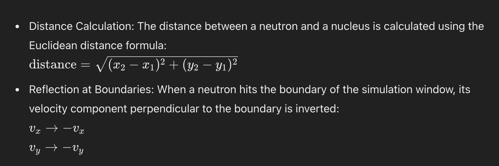

# Nuclear Fission Simulation

## Overview
 This project is a simulation of nuclear fission, created using Python and the Pygame library. The simulation provides a visual representation of nuclear fission processes, allowing users to interact with the system by adding neutrons and nuclei. The program simulates the random motion of neutrons and their interactions with atomic nuclei, including collisions that result in nuclear fission.

### How to Run:

1\.  Ensure you have Python and Pygame installed on your system.

2\.  Run the `main.py` script using Python.

3\.  The simulation window will open, displaying the initial setup of nuclei and neutrons.

### User Interaction:

-   Left Click: Add a neutron at the mouse cursor position.

-   Right Click: Add a nucleus at the mouse cursor position.

## Scientific Principles:

1\.  Nuclear Fission: Nuclear fission is the process by which a heavy atomic nucleus splits into two or more lighter nuclei, accompanied by the release of a significant amount of energy. In our simulation, when a neutron collides with a nucleus, it causes the nucleus to split, releasing energy and additional neutrons.

2\.  Neutron Movement: Neutrons in the simulation move randomly within the defined velocity range. Their motion is governed by basic kinematic equations. When neutrons reach the boundaries of the simulation window, they reflect off the walls, simulating boundary conditions.

3\.  Collision Detection: The simulation detects collisions between neutrons and nuclei based on the distance between their centers. If the distance is less than the sum of their radii, a collision is detected. The collision initiates the fission process.

4\.  Chain Reaction: One of the critical aspects of nuclear fission is the chain reaction. When a nucleus undergoes fission, it releases additional neutrons that can further collide with other nuclei, causing more fission events. This cascading effect is central to the energy release in nuclear reactors and atomic bombs.

5\.  Energy Release: The energy released during nuclear fission is a result of the conversion of mass into energy, as described by Einstein's equation E=mc2E = mc^2E=mc2. In this simulation, the energy release is represented by the creation of new neutrons and the disappearance of the original nucleus.

6\.  Random Motion and Brownian Motion: The movement of neutrons in the simulation can be likened to Brownian motion, which describes the random movement of particles in a fluid due to collisions with other fast-moving molecules. This random motion is essential in spreading neutrons throughout the simulation area.

### Equations and Principles Applied:

## Conclusion 
This nuclear fission simulation provides a visual and interactive way to understand the principles of nuclear fission, neutron behavior, and chain reactions. By adding neutrons and nuclei, users can observe how these particles interact, collide, and initiate fission events, leading to a chain reaction. The simulation is a simplified model, but it captures the essential physics behind nuclear fission processes.

I hope this simulation helps in understanding the fascinating world of nuclear physics and the principles that govern one of the most powerful energy sources known to humanity.